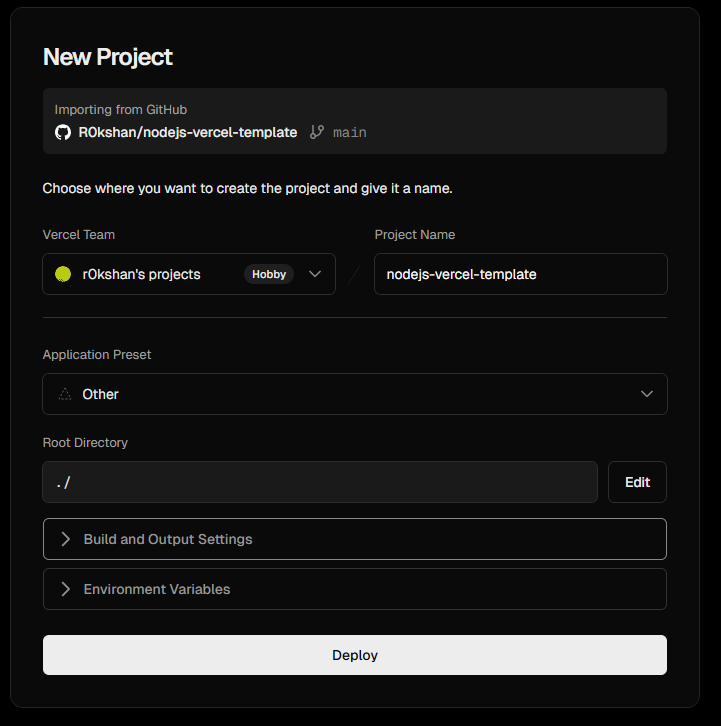

# A NodeJS + Vercel template

A simple Node.js + Vercel example app that can be used as template based on [<https://github.com/vercel/examples>](https://github.com/vercel/examples/tree/main/solutions/node-hello-world) with updated Node.js version.

## Install the Vercel CLI

```
npm i -g vercel
```

## Run Vercel locally

```
vercel dev
```

With debug logs :

```
vercel dev --debug
```

## Deploy to Vercel

Import project and leave all default options as is :



## View deployemnt in Vercel

Enter the following link in your browser :

<https://nodejs-vercel-template-omega.vercel.app/>

or

<https://nodejs-vercel-template-omega.vercel.app/?name=Test>
